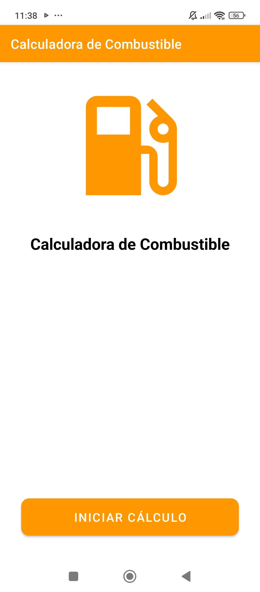
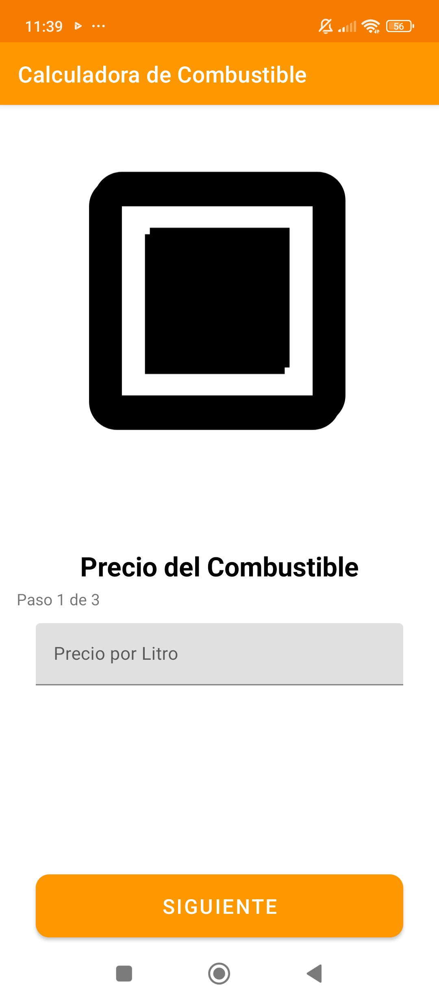
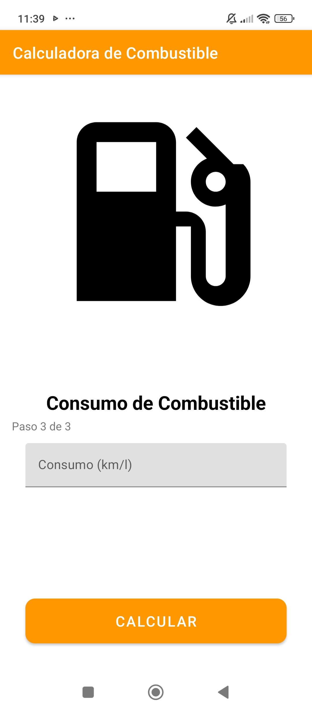
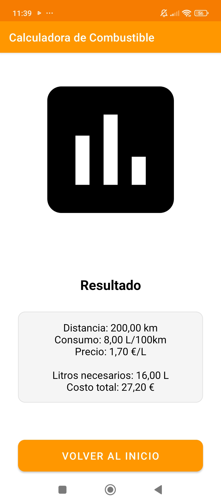
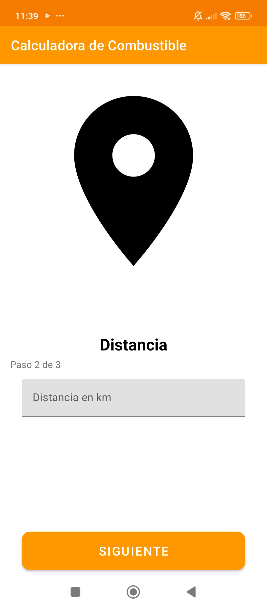

# Fuel Calculator

## Descripción
Fuel Calculator es una aplicación Android diseñada para ayudar a los usuarios a calcular y gestionar sus gastos de combustible. La aplicación permite a los usuarios ingresar el precio del combustible por litro y realizar cálculos relacionados con el consumo de combustible.

## Capturas de Pantalla

*Pantalla principal de la aplicación*


*Pantalla de ingreso del precio del combustible*


*Pantalla de ingreso de distancia*


*Pantalla de ingreso de consumo*


*Pantalla de resultado*

## Características
- Interfaz de usuario intuitiva y fácil de usar
- Cálculo del precio del combustible por litro
- Diseño moderno y atractivo
- Proceso paso a paso para guiar al usuario

## Tecnologías Utilizadas
- Android Studio
- Kotlin
- Material Design Components
- ConstraintLayout

## Requisitos
- Android 5.0 (API level 21) o superior
- Conexión a Internet (para futuras actualizaciones)

## Instalación
1. Clona este repositorio:
```bash
git clone https://github.com/JosueMairao/FuelCalculator3.git
```
2. Abre el proyecto en Android Studio
3. Ejecuta la aplicación en tu dispositivo o emulador

## Uso
1. Abre la aplicación
2. Sigue el proceso paso a paso
3. Ingresa el precio del combustible por litro
4. Utiliza los botones de navegación para avanzar

## Contribución
Las contribuciones son bienvenidas. Por favor, abre un issue primero para discutir los cambios que te gustaría hacer.

## Licencia
Este proyecto está bajo la Licencia MIT. Ver el archivo `LICENSE` para más detalles.

## Contacto
Josue Mairao - [GitHub](https://github.com/JosueMairao)

## Agradecimientos
- Material Design por los componentes de UI
- Android Studio por el entorno de desarrollo 